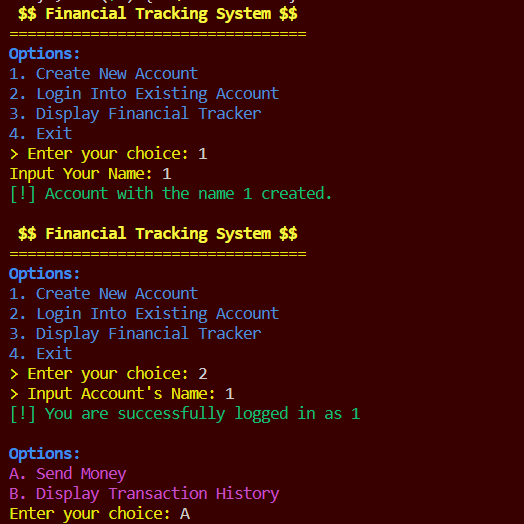

# Final Project 
### Data Structure and OOP

**Kelas A**

**Kelompok 11**
|Nama|NRP|
|--|--|
|Gabriella Erlinda Wijaya|5027221018|
|Jacinta Syilloam|5027221036|
|Nicholas Marco Weinandra|5027221042|

## Simple Financial Management System
under construction mb

### 1. Implements class, property, method, constructor, and destructor

**FinancialEntity class**

- Abstract base class with a pure virtual function display() and a virtual destructor.

```
class FinancialEntity
{
public:
    virtual void display() const = 0; // Abstract method
    virtual ~FinancialEntity() {}     // Virtual destructor
};
```


**Transaction class**

- Properties: transaction_id, amount, and description.
- Constructor: Initializes the properties.
- Method: display() to print transaction details.

```
class Transaction : public FinancialEntity
{
private:
    int transaction_id;
    double amount;
    string description;

public:
    Transaction(int id, double amt, const string &desc) : transaction_id(id), amount(amt), description(desc) {}

    void display() const override
    {
        cout << "Transaction: " << transaction_id << ": $" << amount << " - " << description << endl;
    }

    double getAmount() const { return amount; }
};
```


**Account class**

- Properties: nextAccountId (static), account_id, owner, and transactions (vector of Transaction pointers).
- Constructor: Initializes account_id and owner.
- Destructor: Deallocates dynamically allocated transactions.
- Methods: addTransaction(), displayTransactions(), display().
```
class Account : public FinancialEntity
{
private:
    static int nextAccountId;
    int account_id;
    string owner;
    vector<Transaction *> transactions;

public:
    Account(const string &own) : account_id(nextAccountId++), owner(own) {}

    ~Account()
    {
        for (Transaction *transaction : transactions)
        {
            delete transaction;
        }
    }

    void addTransaction(Transaction *transaction)
    {
        transactions.push_back(transaction);
    }

    void displayTransactions() const
    {
        for (const Transaction *transaction : transactions)
        {
            transaction->display();
        }
    }

    void display() const override
    {
        // Display account details and transactions
    }

    int getAccountId() const { return account_id; }
    const string &getOwner() const { return owner; }
};

int Account::nextAccountId = 1;
```


**FinancialTrackingSystem class**

- Properties: accounts (vector of Account), adjacencyMatrix.
- Methods: addAccount(), findAccountByName(), addTransactionBetweenAccounts(), displayAccounts().

```
class FinancialTrackingSystem
{
private:
    vector<Account> accounts;
    vector<vector<double>> adjacencyMatrix;

public:
    void addAccount(const Account &account)
    {
        // Add account to the system
    }

    Account *findAccountByName(const string &name)
    {
        // Find account by name
    }

    void addTransactionBetweenAccounts(const string &fromAccountOwner, const string &toAccountOwner,
                                       Transaction *senderTransaction, Transaction *receiverTransaction)
    {
        // Add transactions between accounts
    }

    void displayAccounts() const
    {
        // Display all accounts
    }
};
``` 


**Polymorphism class**

- Methods with the same name getTransactionAmount() but with different parameter types, demonstrating method overloading.

```
class Polymorphism
{
public:
    void getTransactionAmount(double &amount)
    {
        // Get transaction amount for double
    }

    void getTransactionAmount(int &amount)
    {
        // Get transaction amount for int
    }

    void getTransactionAmount(float &amount)
    {
        // Get transaction amount for float
    }
};
```


### 2. Adjacency matrix

-  The adjacency matrix is used to represent relationships between accounts in the FinancialTrackingSystem class. The matrix stores the transaction amounts between different accounts.
- The adjacency matrix is a 2D vector (adjacencyMatrix) where each element [i][j] represents the amount of money transferred from account with ID i+1 to account with ID j+1. If money is sent from account i to account j, then the corresponding element [i][j] is updated with the transaction amount.
- The adjacency matrix allows for efficient tracking of financial transactions between different accounts in the system. Each element of the matrix represents the total amount of money transferred between the corresponding pair of accounts.


```
class FinancialTrackingSystem
{
private:
    vector<Account> accounts;
    vector<vector<double>> adjacencyMatrix;

public:
    // Other methods...

    void addTransactionBetweenAccounts(const string &fromAccountOwner, const string &toAccountOwner,
                                       Transaction *senderTransaction, Transaction *receiverTransaction)
    {
        Account *fromAccount = findAccountByName(fromAccountOwner);
        Account *toAccount = findAccountByName(toAccountOwner);

        if (fromAccount && toAccount)
        {
            // Debit transaction (money sent) for the sender
            fromAccount->addTransaction(senderTransaction);

            // Credit transaction (money received) for the receiver
            toAccount->addTransaction(receiverTransaction);

            // Update the adjacency matrix based on the transaction type (debit or credit)
            double transactionAmount = senderTransaction->getAmount();
            if (transactionAmount < 0)
            { // Debit (money sent)
                adjacencyMatrix[fromAccount->getAccountId() - 1][toAccount->getAccountId() - 1] += transactionAmount;
            }
            else
            { // Credit (money received)
                adjacencyMatrix[toAccount->getAccountId() - 1][fromAccount->getAccountId() - 1] += transactionAmount;
            }
        }
        else
        {
            cout << "\033[31m[!] Error: One or more accounts not found.\033[0m" << endl;
        }
    }
};
```

```
// Update the adjacency matrix based on the transaction type (debit or credit)
double transactionAmount = senderTransaction->getAmount();
if (transactionAmount < 0)
{ // Debit (money sent)
    adjacencyMatrix[fromAccount->getAccountId() - 1][toAccount->getAccountId() - 1] += transactionAmount;
}
else
{ // Credit (money received)
    adjacencyMatrix[toAccount->getAccountId() - 1][fromAccount->getAccountId() - 1] += transactionAmount;
}
```


### 3. Instantiate class

- Transaction is derived from FinancialEntity and represents a financial transaction.
- Instances of Transaction are created in the main function when a financial transaction occurs.
- These lines dynamically allocate memory for Transaction objects and initialize them with the specified parameters. The transactions are then added to the respective accounts.


```
Transaction *senderTransaction = new Transaction(userAccount->getAccountId(), -amount, "\033[31m[!] Sent money to \033[0m" + receiverName);
Transaction *receiverTransaction = new Transaction(userAccount->getAccountId(), amount, "\033[32m[!] Received money from \033[0m" + userAccount->getOwner());

```

- Same goes with other class that are not an abstract class


### 4. Implements abstract class

- An abstract class is a class that has at least one pure virtual function. A pure virtual function is a virtual function that is declared in the base class but has no implementation. Abstract classes cannot be instantiated on their own; they are meant to be inherited by concrete (non-abstract) classes.
- If a class fails to provide an implementation for a pure virtual function, it remains abstract, and attempts to instantiate objects of that class will result in a compilation error.
- Abstract classes are useful for creating a common interface that derived classes must implement, ensuring a certain level of consistency across multiple classes in a hierarchy.

```
class FinancialEntity
{
public:
    virtual void display() const = 0; // Pure virtual function
    virtual ~FinancialEntity() {}     // Virtual destructor
};
```


### 5. Implements encapsulation: Public and private

- The Transaction class has private members transaction_id, amount, and description.
- The Account class has private members nextAccountId, account_id, owner, and transactions. Additionally, the destructor (~Account()) is private, emphasizing that it should only be called from within the class.
- These private members are not directly accessible from outside their respective classes, promoting encapsulation and preventing external code from directly manipulating or accessing the internal details of the classes.


```
class Transaction : public FinancialEntity
{
private:
    int transaction_id;   // Private member
    double amount;        // Private member
    string description;   // Private member

public:
    // Constructor and public methods...
};

class Account : public FinancialEntity
{
private:
    static int nextAccountId;   // Private static member for auto-incrementing account IDs
    int account_id;             // Private member
    string owner;               // Private member
    vector<Transaction *> transactions;   // Private member

public:
    // Constructor and public methods...

private:
    // Private destructor to deallocate dynamically allocated transactions
    ~Account()
    {
        for (Transaction *transaction : transactions)
        {
            delete transaction;
        }
    }
    
    // Private static member initialization
    static int nextAccountId;
};

// Static variable initialization
int Account::nextAccountId = 1;
```


### 6. Implements inheritance: Single / Hierarchical / Multilevel

**Single Inheritance:**

The Transaction class inherits from the FinancialEntity class. This is an example of single inheritance. The Transaction class is a derived class, and FinancialEntity is its base class.


**Hierarchical Inheritance:**

Both the Transaction and Account classes inherit from the FinancialEntity class. This creates a hierarchy where FinancialEntity is the base class for both Transaction and Account. This is an example of hierarchical inheritance.


### 7. Implements polymorphism: Overriding and overloading

**Overriding**

- The FinancialEntity class declares a pure virtual function display() using virtual void display() const = 0;. This makes FinancialEntity an abstract class, and any class derived from it must provide an implementation for the display() function.
- Both Transaction and Account classes inherit from FinancialEntity and provide their own implementations of the display() function. This is an example of overriding.
- In the derived classes (Transaction and Account), the display() function is marked with the override keyword to explicitly indicate that it is intended to override a virtual function from the base class.


```
class FinancialEntity
{
public:
    virtual void display() const = 0; // Abstract method
    virtual ~FinancialEntity() {}     // Virtual destructor
};

class Transaction : public FinancialEntity
{
    // ...
    void display() const override
    {
        // ...
    }
};

class Account : public FinancialEntity
{
    // ...
    void display() const override
    {
        // ...
    }
};
```


**Overloading**

- The Polymorphism class provides three overloaded functions named getTransactionAmount. Each function takes a different type of parameter (double, int, and float), demonstrating function overloading.


```
class Polymorphism
{
public:
    void getTransactionAmount(double &amount)
    {
        // ...
    }
    void getTransactionAmount(int &amount)
    {
        // ...
    }
    void getTransactionAmount(float &amount)
    {
        // ...
    }
};
```


### 8. Implements composition

- The code demonstrates composition in several ways, particularly through the relationships between classes and their usage in the FinancialTrackingSystem class. Let's go through the instances of composition.
- This use of the vector<Transaction *> is an example of composition, where the Account class is composed of transactions to represent the relationship "Account has a collection of transactions."


```
class Account : public FinancialEntity
{
private:
    // other member variables...

    vector<Transaction *> transactions; // Composition: Account "has a" collection of Transaction objects

public:
    // other member functions...

    ~Account()
    {
        // Destructor to deallocate dynamically allocated transactions
        for (Transaction *transaction : transactions)
        {
            delete transaction;
        }
    }

    void addTransaction(Transaction *transaction)
    {
        transactions.push_back(transaction);
    }

    void displayTransactions() const
    {
        for (const Transaction *transaction : transactions)
        {
            transaction->display();
        }
    }

    // other member functions...
};
```


### A sprinkle of creativity ;D

**Added text and color styling**
